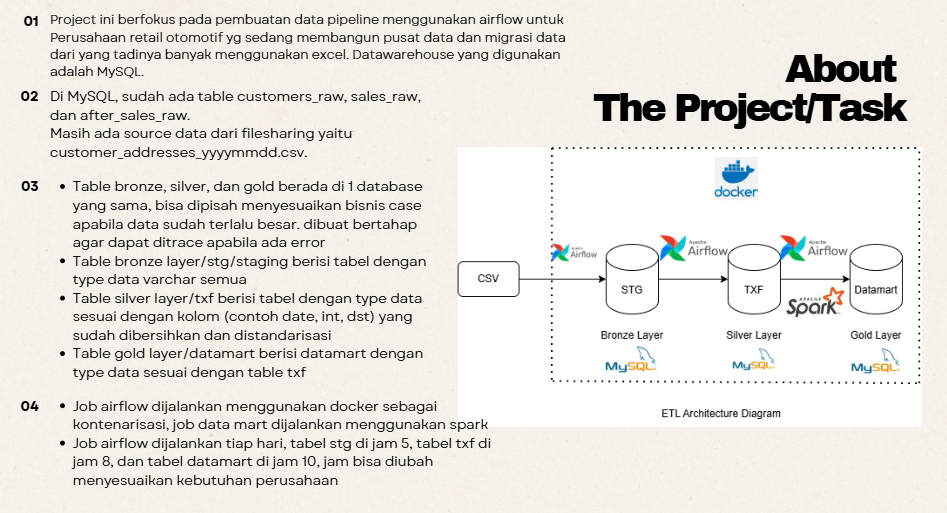

# End-To-End-Data-Pipeline-Using-Airflow-Docker-Spark-MySQL-CSV

Tools: Airflow 3.1.8, Docker, Spark, MySQL Local, VS Code (IDE)

<<<<<<< HEAD
<p align="center">
    <br>
    About The Project 
   </p>

PPT dapat diakses di folder PPT atau lewat link canva berikut: https://canva.link/t7qcvhtofkyou03

Script python ada di folder dags
=======


<p align="center">About The Project</p>

PPT dapat diakses di folder `PPT` atau melalui link Canva berikut:
[Buka PPT](https://canva.link/t7qcvhtofkyou03)

Script Python tersedia di folder `dags`.

## Step by Step Menjalankan Project

### 1. Siapkan konfigurasi

Pastikan Docker Desktop dan MySQL Local sudah berjalan. 

### 2. Build dan initialize Airflow

```powershell
docker compose build
docker compose up airflow-init
```

### 3. Start services

```powershell
docker compose up -d
docker compose ps
```

Pastikan service Airflow dan Spark berstatus `Up` atau `healthy`.

### 4. Buka Airflow dan konfigurasi MySQL

Buka Airflow di [http://localhost:8090](http://localhost:8090). Di **Admin >
Connections**, buat MySQL Connection dengan ID `mysql-localhost`, schema
`mysql-dwh-dev`, port `3306`, serta username dan password MySQL.

Karena MySQL berjalan di Windows host, maka host diisi dengan `host.docker.internal`.

### 5. Jalankan DAG sesuai urutan

Trigger DAG dari Airflow UI. Jalankan staging dan TXF terlebih dahulu:

```text
ingest_stg_customer_address_csv
task_ingest_txf_customer
task_ingest_txf_sales
task_ingest_txf_after_sales
task_ingest_txf_customer_address
```

Setelah tabel TXF tersedia, jalankan data mart PySpark:

```text
task_ingest_sales_datamart
task_ingest_cust_service_prio_datamart
```

### 6. Stop services

```powershell
docker compose down
```

### Akses UI:
- Airflow UI: `http://localhost:8090`
- Spark Master UI: `http://localhost:8081`
- Spark Worker UI: `http://localhost:8082`
>>>>>>> spark
